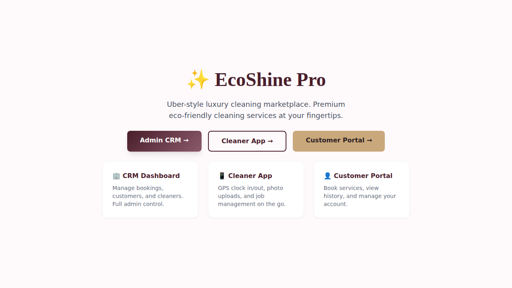
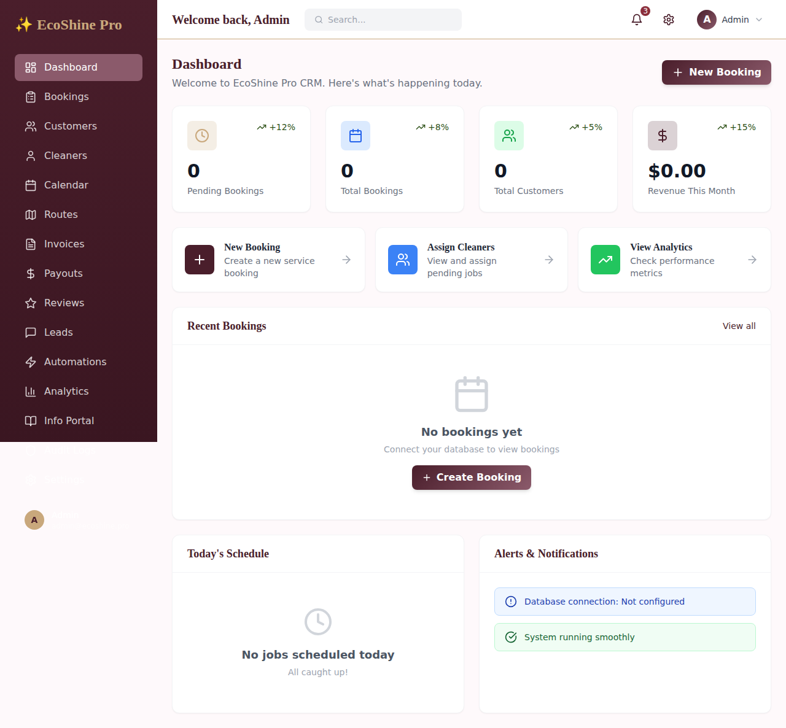
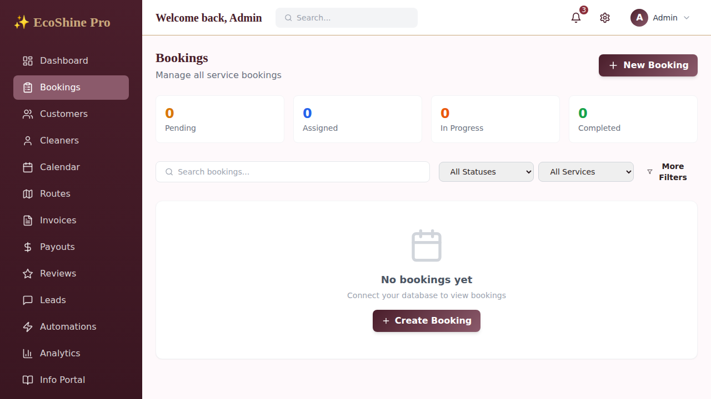
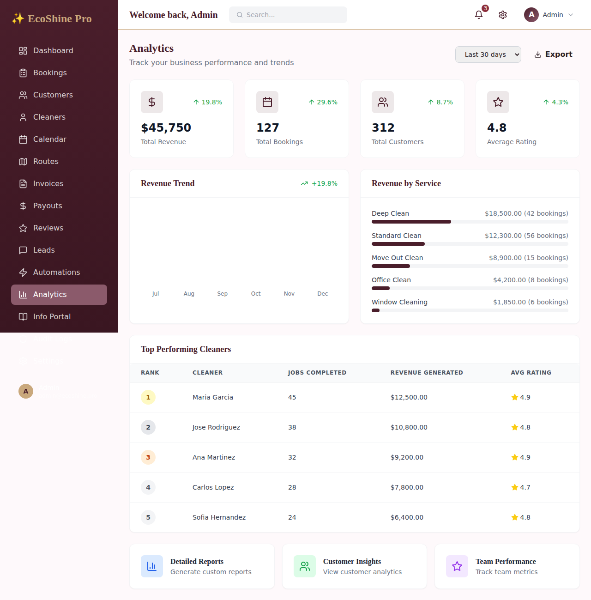
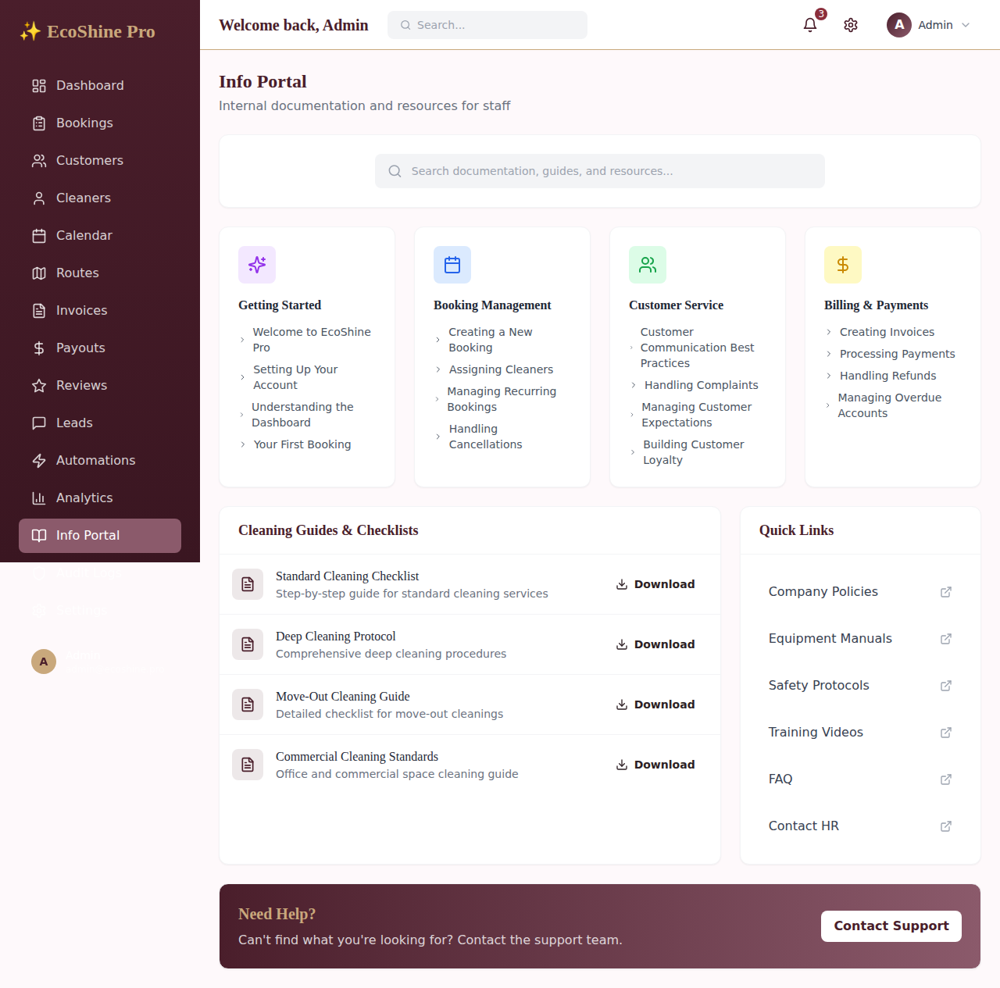
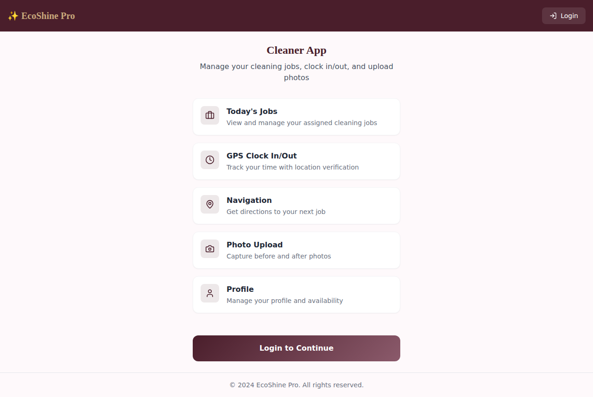
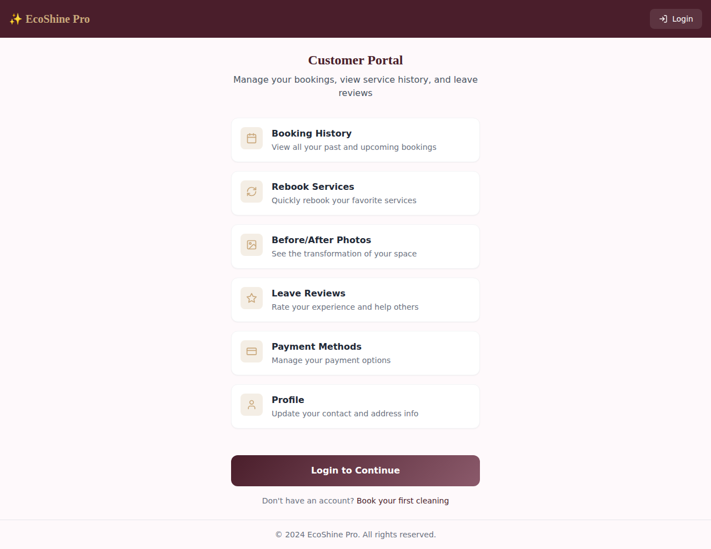

# 🌟 EcoShine Pro - Luxury Cleaning Marketplace

> **Enterprise-grade cleaning service management platform** with complete CRM, mobile cleaner app, and customer portal.

[](https://nextjs.org/)
[](https://www.typescriptlang.org/)
[](https://orm.drizzle.team/)
[](https://tailwindcss.com/)



## 📖 Table of Contents

- [Overview](#overview)
- [Features](#features)
- [Screenshots](#screenshots)
- [Architecture](#architecture)
- [Quick Start](#quick-start)
- [Documentation](#documentation)
- [Tech Stack](#tech-stack)
- [License](#license)

## 🎯 Overview

EcoShine Pro is a comprehensive, enterprise-level cleaning service marketplace platform that connects customers with professional cleaners. Built with modern web technologies, it provides three distinct interfaces:

1. **Admin CRM** - Complete business management dashboard
2. **Cleaner Mobile App** - Field technician interface with GPS tracking
3. **Customer Portal** - Self-service booking and account management

Perfect for cleaning businesses, facility management companies, and service marketplaces.

## ✨ Features

### 🏢 Admin CRM Features

- **Dashboard Analytics** - Real-time business metrics, revenue tracking, and performance indicators
- **Booking Management** - Create, assign, track, and manage all service bookings
- **Customer Management** - Complete customer profiles, history, and communication
- **Cleaner Management** - Team roster, availability, performance tracking, and payouts
- **Calendar View** - Visual scheduling and resource planning
- **Route Optimization** - Plan efficient daily routes for cleaners
- **Invoice & Billing** - Automated invoicing, payment processing, and financial tracking
- **Payout Management** - Cleaner commission tracking and payment distribution
- **Review Management** - Customer feedback and rating system
- **Lead Management** - Sales pipeline and conversion tracking
- **Marketing Automations** - Automated emails, SMS, and customer communications
- **Advanced Analytics** - Revenue trends, service breakdowns, team performance
- **Info Portal** - Internal documentation, guides, and training materials
- **Audit Logs** - Complete system activity tracking
- **Settings & Configuration** - Customize services, regions, pricing, and more

### 📱 Cleaner Mobile App Features

- **Today's Jobs** - View all assigned cleaning jobs for the day
- **GPS Clock In/Out** - Location-verified time tracking
- **Navigation** - Integrated maps and directions to job locations
- **Photo Upload** - Before, during, and after photo documentation
- **Job Status Updates** - Real-time status updates and notifications
- **Earnings Tracker** - View completed jobs and earnings
- **Profile Management** - Update availability and personal information
- **PWA-Ready** - Install as mobile app on any device

### 👤 Customer Portal Features

- **Booking History** - View all past and upcoming services
- **Quick Rebooking** - One-click rebooking of favorite services
- **Before/After Photos** - Photo gallery of completed work
- **Leave Reviews** - Rate cleaners and provide feedback
- **Payment Methods** - Manage credit cards and payment options
- **Profile Management** - Update contact info and service addresses
- **Subscription Management** - Manage recurring cleaning schedules
- **Referral Program** - Earn rewards for referring friends

## 📸 Screenshots

### Admin CRM Dashboard

*Complete overview of business metrics, pending bookings, and quick actions*

### Bookings Management

*Comprehensive booking list with filters, search, and status tracking*

### Analytics & Reporting

*Revenue trends, service breakdowns, and top performer tracking*

### Info Portal

*Internal documentation hub with guides, checklists, and resources*

### Cleaner Mobile App

*Mobile-optimized interface for field technicians*

### Customer Portal

*Self-service portal for customers to manage their accounts*

## 🏗️ Architecture

### Three-Layer Application

```
┌─────────────────────────────────────────────┐
│  LAYER 1: PUBLIC WEBSITE                    │
│  /booking - Customer booking form           │
│  ⚠️ DO NOT TOUCH                            │
└─────────────────────────────────────────────┘
                      ↓
┌─────────────────────────────────────────────┐
│  LAYER 2: ADMIN CRM (/crm)                  │
│  - Manage bookings, customers, cleaners     │
│  - Assign jobs, track time, invoicing       │
│  - Analytics, settings, automations         │
│  👥 ROLES: Admin, Manager, CSR              │
└─────────────────────────────────────────────┘
                      ↓
┌─────────────────────────────────────────────┐
│  LAYER 3A: CLEANER APP (/cleaner)           │
│  - View assigned jobs                       │
│  - GPS clock in/out                         │
│  - Upload before/after photos               │
│  📱 MOBILE-FIRST, PWA-READY                 │
└─────────────────────────────────────────────┘
                      ↓
┌─────────────────────────────────────────────┐
│  LAYER 3B: CUSTOMER PORTAL (/portal)        │
│  - View booking history                     │
│  - Leave reviews                            │
│  - Manage payment methods                   │
└─────────────────────────────────────────────┘
```

## 🎨 Brand Identity

The EcoShine Pro brand uses a luxury color palette with burgundy and gold accents:

```css
PRIMARY:    #4a1e2b  /* Deep Burgundy - buttons, headers */
SECONDARY:  #8b5a6b  /* Rose - hover states */
ACCENT:     #c9a87c  /* Gold - highlights, badges */
BACKGROUND: #fef9fb  /* Soft Cream - page bg */
SUCCESS:    #2d5016  /* Dark Green - completed */
DANGER:     #8b2e3b  /* Dark Red - cancelled */
```

**Typography:**
- Headings: Serif fonts (elegant, professional)
- Body: Sans-serif fonts (clean, readable)

## 📁 Project Structure

```
├── app/
│   ├── crm/              # Admin CRM dashboard
│   │   ├── page.tsx      # Dashboard home
│   │   ├── bookings/     # Booking management
│   │   ├── customers/    # Customer management
│   │   ├── cleaners/     # Cleaner management
│   │   ├── calendar/     # Calendar view
│   │   ├── routes/       # Route planning
│   │   ├── invoices/     # Billing & invoices
│   │   ├── payouts/      # Cleaner payouts
│   │   ├── reviews/      # Review management
│   │   ├── leads/        # Lead management
│   │   ├── automations/  # Marketing automation
│   │   ├── analytics/    # Analytics & reports
│   │   ├── info-portal/  # Documentation hub
│   │   ├── audit-logs/   # Audit trail
│   │   └── settings/     # System settings
│   ├── cleaner/          # Cleaner mobile app
│   │   ├── dashboard/    # Cleaner dashboard
│   │   └── login/        # Cleaner login
│   ├── portal/           # Customer portal
│   │   ├── dashboard/    # Customer dashboard
│   │   ├── bookings/     # Booking history
│   │   ├── book/         # New booking
│   │   ├── profile/      # Profile management
│   │   └── login/        # Customer login
│   └── api/              # API routes
│       ├── bookings/     # Booking endpoints
│       └── cleaner/      # Cleaner endpoints
├── components/
│   ├── crm/              # CRM-specific components
│   ├── cleaner/          # Cleaner app components
│   ├── portal/           # Portal components
│   └── ui/               # Shared UI components
├── lib/
│   ├── auth/             # Authentication & RBAC
│   │   └── roles.ts      # Role definitions
│   ├── db.ts             # Database connection
│   ├── schema.ts         # Drizzle ORM schema (70+ tables)
│   ├── env.ts            # Environment validation
│   └── utils.ts          # Utility functions
├── docs/
│   ├── images/           # Screenshots
│   └── guides/           # Documentation
└── public/
    └── manifest.json     # PWA manifest
```

## 🔐 Role-Based Access Control

- **ADMIN**: Full system access
- **MANAGER**: Team management, reports
- **CSR**: Customer service, bookings
- **TECHNICIAN**: Job execution
- **CUSTOMER**: Portal access

## 🚀 Quick Start

### Prerequisites

- Node.js 18+ and npm
- PostgreSQL database (Supabase, Neon, or local)
- (Optional) Stripe account for payments
- (Optional) AWS S3 for file storage
- (Optional) Google Maps API key
- (Optional) Twilio account for SMS

### 1. Clone Repository

```bash
git clone https://github.com/iboss21/Lux-app-crm.git
cd Lux-app-crm
```

### 2. Install Dependencies

```bash
npm install
```

### 3. Configure Environment

Copy `.env.example` to `.env.local` and fill in your values:

```bash
cp .env.example .env.local
```

**Required environment variables:**
- `DATABASE_URL` - PostgreSQL connection string
- `NEXTAUTH_SECRET` - Random secret for auth (generate with `openssl rand -base64 32`)

**Optional but recommended:**
- Stripe keys for payment processing
- AWS S3 for photo uploads
- Google Maps API for navigation
- Twilio for SMS notifications

### 4. Set Up Database

```bash
# Push schema to database
npm run db:push

# Or generate migrations
npm run db:generate
```

### 5. Run Development Server

```bash
npm run dev
```

Open [http://localhost:3000](http://localhost:3000) to see the app.

### 6. Access Different Interfaces

- **Homepage**: `http://localhost:3000`
- **Admin CRM**: `http://localhost:3000/crm`
- **Cleaner App**: `http://localhost:3000/cleaner`
- **Customer Portal**: `http://localhost:3000/portal`

## 📚 Documentation

Comprehensive guides and documentation:

- **[User Guide](docs/guides/USER_GUIDE.md)** - Complete user manual for all features
- **[Features List](docs/guides/FEATURES.md)** - Detailed breakdown of all features
- **[Installation Guide](docs/guides/INSTALLATION.md)** - Step-by-step setup instructions
- **[API Documentation](docs/guides/API_DOCUMENTATION.md)** - API endpoints and usage
- **[Deployment Guide](docs/guides/DEPLOYMENT.md)** - Production deployment instructions
- **[Database Schema](docs/guides/DATABASE_SCHEMA.md)** - Complete database structure

## 🗄️ Database

Uses **Drizzle ORM** with PostgreSQL (Supabase/Neon compatible).

### Core Tables
- `customers` - Customer records
- `bookings` - Service bookings (all form fields)
- `cleaners` - Cleaner profiles
- `regions` - Service regions
- `timeTracking` - GPS clock in/out
- `jobPhotos` - Before/after photos
- `invoices` - Billing
- `adminUsers` - Admin accounts

### Database Commands

```bash
# Generate migrations
npm run db:generate

# Push schema to database
npm run db:push

# Open Drizzle Studio
npm run db:studio
```

## 🛠️ Tech Stack

### Core Framework
- **Next.js 14** - React framework with App Router
- **TypeScript 5.6** - Type-safe development
- **React 18** - UI library

### Database & ORM
- **PostgreSQL** - Primary database
- **Drizzle ORM** - Type-safe SQL ORM
- **Drizzle Kit** - Database migrations

### Styling & UI
- **Tailwind CSS** - Utility-first CSS
- **Lucide React** - Icon library
- **Recharts** - Data visualization

### Authentication & Security
- **JWT (jose)** - Token-based auth
- **bcryptjs** - Password hashing
- **RBAC** - Role-based access control

### Integrations
- **Stripe** - Payment processing
- **AWS S3** - File storage
- **Twilio** - SMS notifications
- **Resend** - Email service
- **Google Maps** - Navigation & geocoding

### Data Validation
- **Zod** - Schema validation
- **TypeScript** - Compile-time type checking

### Development Tools
- **ESLint** - Code linting
- **PostCSS** - CSS processing
- **Autoprefixer** - CSS vendor prefixes

## 📱 PWA Support

The app is PWA-ready with:
- Web manifest
- Theme colors
- App icons
- Offline capability (future)

## 🔒 Environment Variables

See `.env.example` for all required variables:
- Database URL
- Stripe keys
- Twilio credentials
- Google Maps API
- AWS S3 configuration

## 🤝 Contributing

We welcome contributions! Please follow these steps:

1. Fork the repository
2. Create a feature branch (`git checkout -b feature/amazing-feature`)
3. Commit your changes (`git commit -m 'Add amazing feature'`)
4. Push to the branch (`git push origin feature/amazing-feature`)
5. Open a Pull Request

## 📞 Support

- **Documentation**: [docs/guides](docs/guides/)
- **Issues**: [GitHub Issues](https://github.com/iboss21/Lux-app-crm/issues)
- **Email**: support@ecoshine.pro

## 📝 License

Copyright © 2024 EcoShine Pro. All rights reserved.

---

**Built with ❤️ by the EcoShine Pro team**

